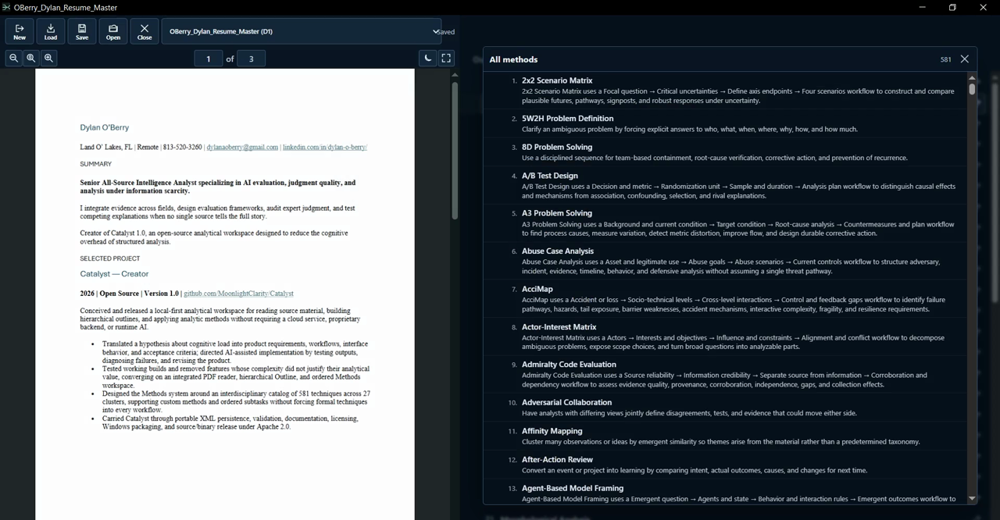

# Catalyst

Catalyst is a local-first analytical workspace for reading source material, building structured outlines, and applying analytic methods without requiring a cloud service, proprietary backend, or AI system.

It is designed for rigorous research and intelligence-style analysis, but it is not limited to intelligence work. Catalyst is useful anywhere a researcher needs to move from source material to a clear, inspectable analytical structure.

## LLM navigation demo

Catalyst 1.0.1 can be operated by an LLM through the same workspace a human uses. This 90-second recording shows deterministic navigation across the PDF reader, Outline, inline notes, the authored Methods workspace, and the complete 581-method catalog.

[](https://github.com/MoonlightClarity/Catalyst/releases/download/v1.0.1/Catalyst-1.0.1-LLM-Demo.mp4)

**[Watch the 90-second Catalyst 1.0.1 LLM navigation demo (MP4)](https://github.com/MoonlightClarity/Catalyst/releases/download/v1.0.1/Catalyst-1.0.1-LLM-Demo.mp4)**

## Statement of mission

Structured analytic techniques do not, by themselves, materially improve intelligence analysis; they operationalize and standardize analytical practice. Catalyst begins with a different question: why can rigorous analytical methods still fail to improve the work? Its hypothesis is cognitive load. Catalyst is an attempt to reduce that load so analysts can apply structure and tradecraft without the tools themselves becoming part of the problem.

## Core workflow

1. **Open a PDF** — work directly with local source documents in the integrated reader.
2. **Build the Outline** — create and edit a numbered hierarchical structure alongside the source.
3. **Develop the analysis** — write notes directly in Outline items and reorganize them as the analysis changes.
4. **Apply Methods when useful** — build an ordered sequence of analytic methods from the catalog or create custom methods.
5. **Export when needed** — use one Export control to download the complete Outline + Methods document as PDF, DOCX, or RTF.
6. **Save locally** — preserve the workspace as portable Catalyst XML while keeping source PDFs separate.
7. **Return later** — load the saved Catalyst session and reconnect its source documents.

Catalyst treats the **Outline as the primary analytical structure**. There is no separate thought, graph, evidence, assessment, or map workspace between the analyst and the outline.

## Design principles

- **Local first.** Core work does not depend on an account or hosted application backend.
- **Source centered.** The reader and analytical workspace stay together without modifying the original PDF.
- **Outline first.** Analytical structure should be explicit, compact, and easy to reorganize.
- **Methods are optional.** Structured analytic techniques support judgment; they do not replace it.
- **Low cognitive load.** Catalyst favors a small number of durable surfaces over feature-heavy workspaces.
- **Inspectable work.** Analytical structure and method responses remain visible and editable rather than hidden behind automation.
- **Open implementation.** Catalyst is built from standard web technologies and licensed for reuse and modification.

## What Catalyst includes

### PDF reader

Catalyst opens local PDF documents through EmbedPDF (`@embedpdf/react-pdf-viewer`). EmbedPDF owns the reader and native PDF annotation tools; Catalyst does not maintain a parallel marks toolbar or custom annotation layer.

Catalyst does not alter the original PDF as a side effect of workspace persistence. Source documents remain separate from Catalyst session files, while annotations created through the native EmbedPDF tools can be preserved with the Catalyst workspace.

### Outline

The Outline is the main authoring surface. It supports hierarchical, numbered analytical notes with inline editing and direct structural controls for adding, deleting, indenting, outdenting, and reordering items.

The Outline is intended to remain useful from an initial rough structure through a developed analytical argument without requiring a separate workspace or ontology.

### Methods

Methods provide an independent ordered workspace for structured analytic techniques. A method can come from Catalyst's catalog or be created as a custom method.

Methods can contain ordered subtasks and response fields, allowing the analyst to adapt a technique to the problem rather than treating the catalog as a fixed form library. Catalog clusters are used for filtering and discovery rather than becoming part of the analytical output.

Methods are optional: a Catalyst session can be built entirely around the source and Outline when formal techniques are unnecessary.

### Export

Catalyst provides one document-export path for the complete analytical output. **Export** places the full Outline first, followed by the authored Methods sequence, and lets you choose PDF, DOCX, or RTF. All three formats include Outline titles and note bodies plus Method names, step names, and analyst-entered responses; catalog summaries and instructional prompts are excluded. Collapsed items are still included.

Export is a downstream handoff, not a workspace format. Use `.catalyst.xml` Save/Load when you need to preserve or reopen editable Catalyst state.

### Local sessions

Catalyst persists workspace state through XML. Explicit saves produce portable `.catalyst.xml` session files. Source PDFs remain separate and are reconnected when a saved session is reopened.

## Technology

Catalyst's active application is intentionally small:

- React
- TypeScript
- Vite
- EmbedPDF (`@embedpdf/react-pdf-viewer`)
- XML-backed Catalyst session persistence

The active application is browser-based and local. Legacy experiments and retired implementation material are not part of the runtime.

The binary release does not contain test files.

## Getting started

### Requirements

- Windows with PowerShell
- Node.js and npm

From the repository root:

```powershell
powershell -ExecutionPolicy Bypass -File .\install.ps1
powershell -ExecutionPolicy Bypass -File .\run.ps1
```

Catalyst runs locally at `http://127.0.0.1:5173`.

`run.ps1` verifies the dependency state and can install missing dependencies automatically unless `-SkipInstall` is used.

For direct npm development:

```powershell
npm ci
npm run dev
```

## Validation

Run the standard repository gate with:

```powershell
npm run check
```

or use the PowerShell wrapper:

```powershell
powershell -ExecutionPolicy Bypass -File .\test.ps1
```

For the fullest local validation path:

```powershell
powershell -ExecutionPolicy Bypass -File .\test.ps1 -Full
```

## Repository layout

- `src/app/` — application controllers and orchestration
- `src/domain/` — analytical and workspace domain model
- `src/features/analysis/` — Outline workspace
- `src/features/techniques/` — Methods workspace and catalog interaction
- `src/persistence/` — XML session persistence
- `src/viewer/` — PDF reader integration
- `src/styles/` — application styling
- `scripts/` — validation, licensing, and maintenance checks
- `docs/` — engineering documentation and project decisions
- `legacy/` — retired implementation material retained for reference

For deeper engineering context, start with [`docs/README.md`](docs/README.md). Source handoffs for continued development can be produced with `gather_source.ps1`.

## License

Catalyst is licensed under the [Apache License 2.0](LICENSE.txt).

Third-party dependency licensing is documented in [`LICENSES.md`](LICENSES.md).
